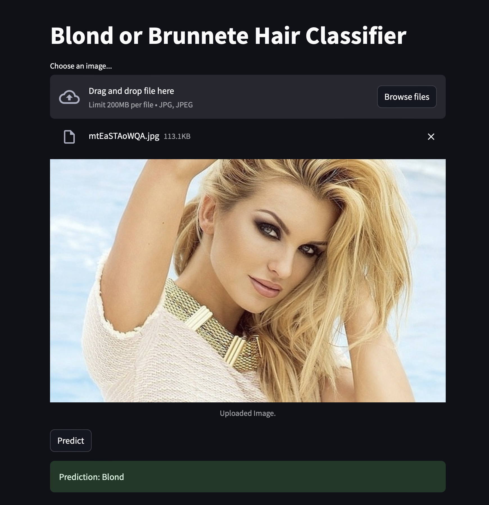
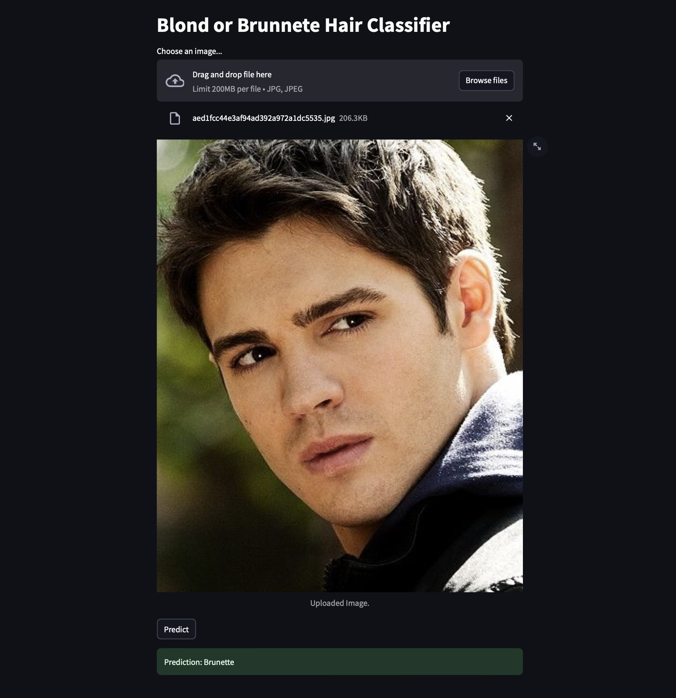

# PMLDL-MLOps
Assignment 1 for "Practical Machine Learning and Deep Learning" Innopolis University course.

## Blond or Brunette Classification Model Web App using Streamlit and FastAPI

This project uses a ResNet model to classify images, trained and validated on a dataset of Celeb images.

## Example of working app:<br>
<div style="display: flex; justify-content: space-between;">
   
   
</div>

## Prerequisites
- Python 3.x
- CUDA (optional, for GPU acceleration)

## Project Structure
```
├── code
│   ├── datasets          # Dataset directory (need to download)
│   ├── deployment
│   │   ├── api           # FastAPI code, Dockerfile, and saved model (need to download)
│   │   └── app           # Streamlit app code and Dockerfile
│   ├── docker-compose.yml # Docker Compose file for both API and web app
│   └── models            # Script for model training
```

## Setup Instructions

1. Clone the repository and navigate to the code/deployment directory:
   ```bash
   git clone https://github.com/Nazgulitos/PMLDL-MLOps.git
   cd code/deployment
   ```

2. Download the model file or train your own model using instructions in [code/models] directory :

    2.1. Download the `model.pth` file from the following link:
    [Download model.pth](https://drive.google.com/file/d/1K9t5hI8dZC_foQluOKY1BVETCxP1Yb8c/view?usp=sharing)

    2.2. Place the downloaded `model.pth` file in the [code/deployment/api] directory.

3. Run the Docker Compose file:
   ```bash
   docker-compose up --build
   ```

4. Open the app in your browser:
   ```bash
   http://localhost:8501
   ```

5. Make a prediction by uploading an image file.
